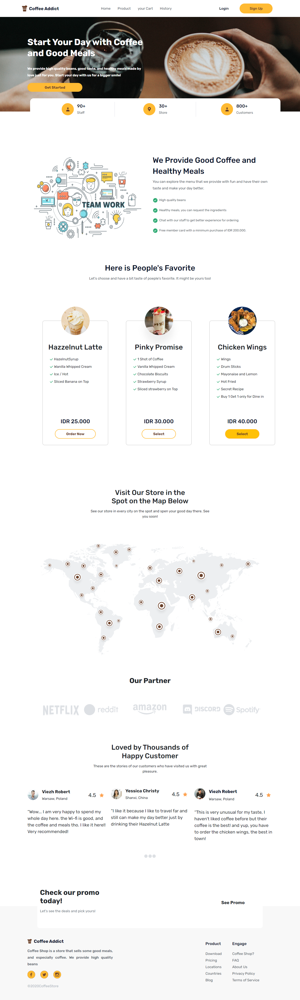
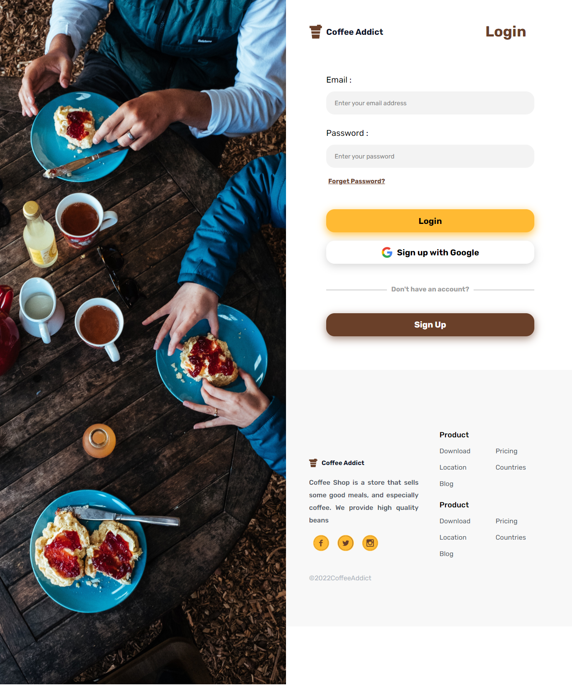
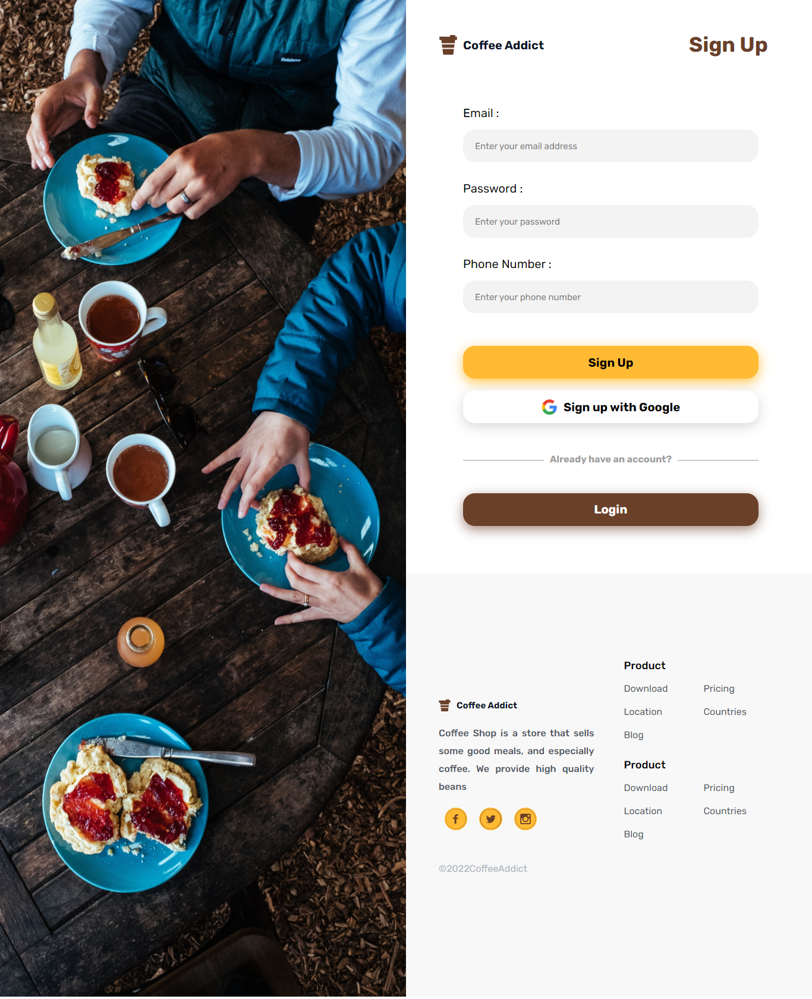
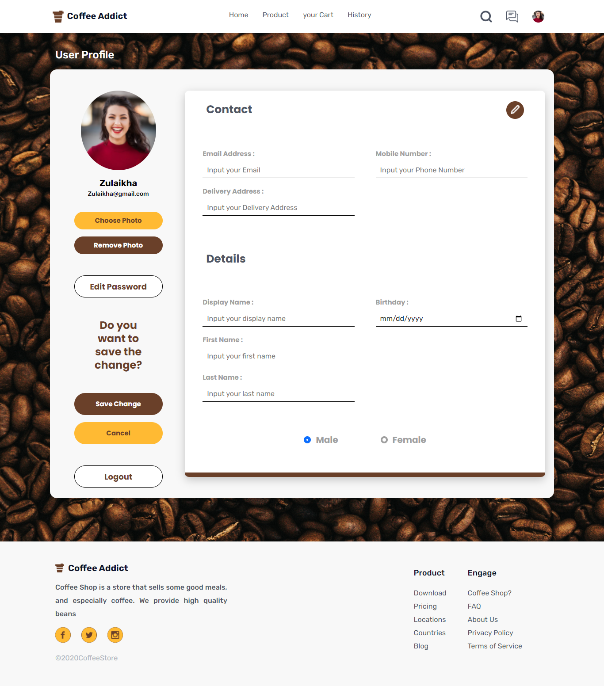
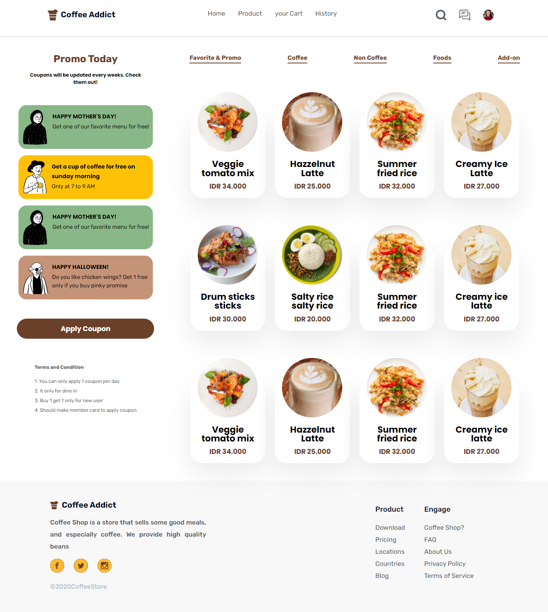

## Built With

- `HTML`
- `CSS`
- `Bootstraps`

 

## Website

- [ ``√`` ] `Home Page`
- [ ``√`` ] `Home Sign-Up`
- [ ``√`` ] `Home Login`
- [ ``√`` ] `Home Product`
- [ ``√`` ] `Home Profile`

 

## Contact

Muhammad Farisan H - [@farisan\_\_](https://instagram.com/farisan99__) - muhammad.farisan99@gmail.com

 

## Deploy Website

Link Website : https://coffeeaddictnew.netlify.app/

 

## Github

Project Link: [https://github.com/farisan/Coffee_addict-Frontend.git](https://github.com/farisan/Coffee_addict-Frontend.git)

 

## User Interface Website

1. Home Page
 
 

 

2. Login
 
 

 

3. Sign Up
 
 

 

4. Profile
 
 

 

5. product
 
 

